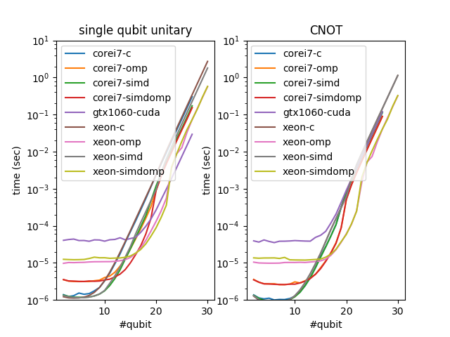

# qcsim
Quantum circuit simulator with C and CUDA

---

## Build and Requirements

Developped with Microsoft Visual Studio 2015 Community with CUDA 8.0.
I Confirmed gcc-5.3.0 can compile it.
Speed comparison (time per local operation) is shown below.


## Usage

There are three way to launch Simulator: Console, FileIO, or DLL.

### from console

We can operate quantum state with lines of commands.
The first integer is recognized as the num_of_qubit.
```
[num_of_qubit]
[message1]
[message2]
...
```

#### Operations
##### 1Qubit unitary
```
0 [target] [theta] [phi] [lambda]
```
U(theta,phi,lambda) is applied to the target-th qubit.
U(theta,phi,lambda) = R_Z(phi) R_Y(theta) R_Z(lambda), which is equivalent to QASM.

##### CNOT
```
1 [target] [control]
```
NOT operation on the target-th qubit contolled by the control-th qubit.

##### Measurement
```
2 [target]
```
Z-basis measurement on the target-th qubit.
Then, the simulator outputs the measurement results to stdout.

##### Initialize
```
3
```
State vector is initilized to |0>^n

##### Dump
```
4
```
Dump all the state vector to stdout.
It takes a long time exponentially to n.

##### Exit
```
5
```
Exit simulation.

#### Example, bell state generation and measurement two times

```
2
0 0 1.57 0 0
1 0 1
2 0
2 1
3
0 0 1.57 0 0
1 0 1
2 0
2 1
5
```


### from text

```
[exe_name] [in_file]
```
The simulator execute [in_file] and output results to stdout.

```
[exe_name] [in_file] [out_file]
```
The simulator execute [in_file] and output results to [out_file].

### Through DLL

DLL File provides interface to the simulator.
The following functions are exported.

#### Operations

##### void init(unsgined int n)
Researve memory for n-qubit.

##### void close()
Release the reserved memory

##### void u(unsigned int target, double theta, double phi, double lambda)
1Qubit Unitary operation

##### void cx(unsigned int target, unsigned int control)
CNOT

##### void meas(unsigned int target)
Measurement,

#### Example
For example, in the case of python,
```python
from ctypes import *
dll = cdll.LoadLibrary(dllName)
dll.init(2)
dll.u(0,c_double(1.57),c_double(0.),c_double(0.))
dll.cx(0,1)
res1 = dll.meas(0)
res2 = dll.meas(1)
dll.close()
```
